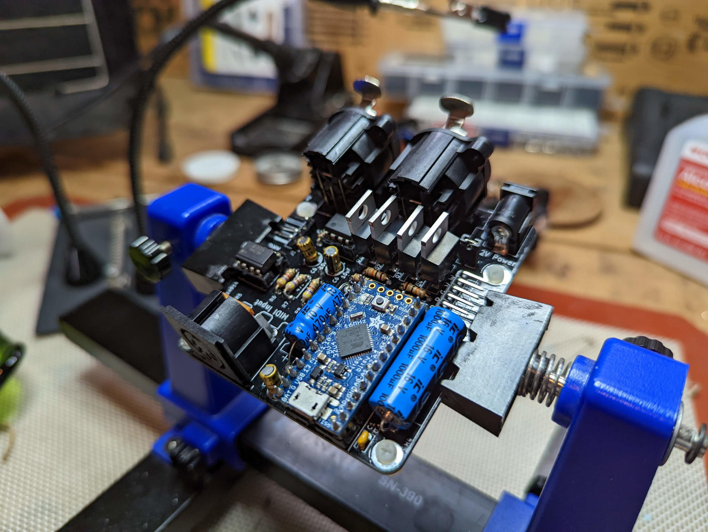
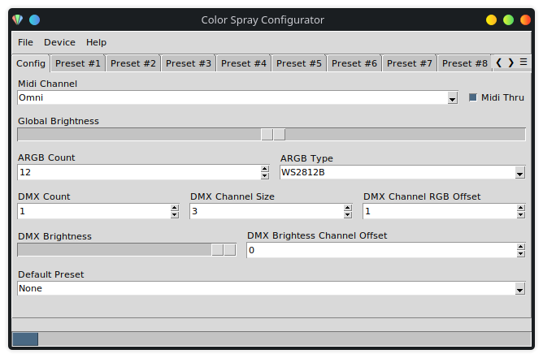
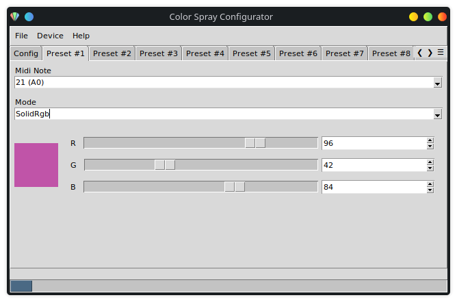
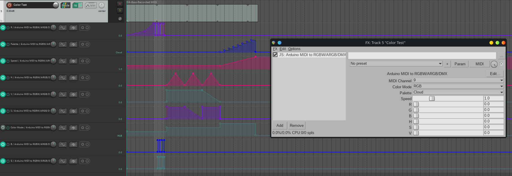

# Color Spray
> Convert Midi input to ARGB, RGBW, and DMX outputs with an Arduino.

## Hardware
This project is designed specifically for the [Adafruit Itsy Bitsy 32u4 - 5V 16MHz](https://learn.adafruit.com/introducting-itsy-bitsy-32u4/), but any other Arduino-compatible MCU with similar specifications should be usable with minor modifications. The PCB design will require modification to use a different development board.

For 5V/12V RGBW operation, you can choose between NPN or N-channel MOSFETs in a TO-220 package _(ie: IRF540N, IRLB8721, or TIP-120)_. The resistors before the gate may not be necessary if you use a MOSFET, but are necessary if you use an NPN transistor. If you are using 5V LEDs, you'll need to bridge JP1 and make sure not to also plug a 12V source into the barrel jack at the same time or you may fry the arduino and any devices plugged into the ARGB connectors. If you use 12V LEDs, make sure that JP1 is not connected and provide a separate 12V power source into the barrel jack that is center-positive.

An XLR connector is provided as an alternative to the ARGB pin header. This connector is non-standard and is intended for custom installations where long, secure cable runs are desired. Avoid mixing the DMX and ARGB connections, though I've attempted to make their pinouts very similar to avoid shorting.

## Configuration
The device's configuration is stored within the internal EEPROM memory of the Atmel 32u4. If the appropriate configuration settings aren't already installed, the device will reformat the EEPROM to it's default settings. Midi SysEx messages are used in order to read and write new configuration settings.

A python-based configurator GUI program is provided to help read, backup, and write device configuration to the Color Spray. The program can be run after installing all [dependencies](configurator/manual.md#dependencies) by running `python configurator/configurator.py` from the root directory of the repository. More information is provided in the [manual](configurator/manual.md).

    
    

## MIDI Implementation

### Configuration

> Depending on how the software is compiled and uploaded to the Arduino, you can use hardware UART Midi or USB Midi to control this device. The Rev1 PCB is configured with a DIN-5 Midi input only. Future revisions may include Midi output.

Change the `USB_MIDI` definition to enable USB Midi input support. The `MIDI_THRU` definition will enable Midi Thru support via hardware UART and USB if it is enabled.

By default, the `MIDI_CHANNEL` definition is set to Omni mode. This will accept all compatible incoming messages on any channel. Change the value of this definition to a number between 1-16 to assign this device to a particular Midi channel.

### Midi Thru

Some software-based Midi Thru functionality is included, but not all message types are supported. It is recommended that you use a hardware Midi Thru device in conjuction if you intend to use multiple devices on the same output.

### Program Change

> More program modes are planned for the future.

| Program | Description   |
| ------- | ------------- |
| 0       | Off           |
| 1       | Solid RGB     |
| 2       | Solid HSV     |
| 3       | Palette Cycle |

### Control Change

Control change messages are generally allocated to different General Purpose Controller functions and are separated for each program mode.

| Control | Function   | Value (0-127, scaled)    | Program       |
| ------- | ---------- | ------------------------ | ------------- |
| 12      | Palette    | _See Available Palettes_ | Palette Cycle |
| 13      | Speed      | 0-4                      | Palette Cycle |
| 16      | Red        | 0-254                    | Solid RGB     |
| 17      | Green      | 0-254                    | Solid RGB     |
| 18      | Blue       | 0-254                    | Solid RGB     |
| 80      | Hue        | 0-254                    | Solid HSV     |
| 81      | Saturation | 0-254                    | Solid HSV     |
| 82      | Value      | 0-254                    | Solid HSV     |

#### Palettes

There are 8 palettes available all contributed by the _FastLED_ library. Custom palettes can be added relatively easily prior to compilation. See the [FastLED wiki](https://github.com/FastLED/FastLED/wiki/Gradient-color-palettes) for more details.

| Index | Midi CC Value | Palette        |
| ----- | ------------- | -------------- |
| 0     | 0-15          | Cloud          |
| 1     | 16-31         | Lava           |
| 2     | 32-47         | Ocean          |
| 3     | 48-63         | Forest         |
| 4     | 64-79         | Rainbow        |
| 5     | 80-95         | Rainbow Stripe |
| 6     | 96-111        | Party          |
| 7     | 112-127       | Heat           |

## DAW Plugins

> The only plugin provided for improved control and synchronization of this device is written for REAPER. The specifications are all provided for extending support to other platforms, but that is not planned currently.

### REAPER (JSFX)

Use the provided sliders to configure this device or enable trim automation on each setting to synchronize your lighting to your song.

Copy and paste `plugins/color-spray-jsfx` into your REAPER JSFX install directory (ie: .../REAPER/Effects). Add the plugin to a track in your project; it will be named _Color Spray_.

## Software Dependencies
* [MIDI](https://github.com/FortySevenEffects/arduino_midi_library/)
* [Arduino USB-MIDI Transport](https://github.com/lathoub/Arduino-USBMIDI)
* [FastLED](https://fastled.io/)
* [DmxSimple](https://github.com/PaulStoffregen/DmxSimple)

---

[OSHW] US00211 | Certified open source hardware | oshwa.org/cert.
